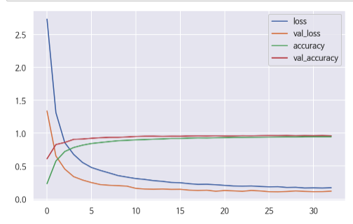

# Traffic sign recognition

## Goals
- 표지판 분류를 모델 만들기

## Technical Skills
- Python, keras

## Workflow
- **Step1** : 도로교통공단 교통안전표지 일람표에서 표지판 이미지 추출
  - 출처 : https://www.koroad.or.kr/kp_web/safeDataView.do?board_code=DTBBS_030&board_num=100162

- **Step 2** : Image Augementation 진행
  - 실제 표지판 분류에 활용될 영상을 고려햐여, 회전, 휘어짐 정도, 명도, 각도 등을 고려

- **Step 3** : 모델링
  - keras로 CNN 구현

- **Step 4** : 검증
  - 예측하지 못한 데이터 직접 확인

## Detail

#### image augementation
- 각 표지판 이미지를 1000장씩 augementation 진행
- 영상에서 표지판이 인식되는 이미지의 모양을 고려하여, 이미지 왜곡, 회전등의 값을 설정

### model

#### accuracy, loss 

  - EarlyStopping을 사용해 val_loss를 모니터함.
  - 총 26번의 epoch가 돌았음.

## 결과분석

  - 사람의 눈으로 판단하기 힘든 데이터들은 예측해 내지 못함
  

  
  - 실제 표지판 사진으로 예측

## 한계 및 개선점
 - Image Augementation의 옵션을 더 조정해 모델 성능 개선이 필요 (이미지 수량 및 품질 개선)
 - 모델링 개선 필요
